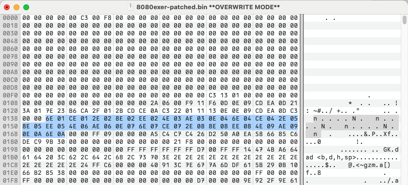

# 8080exer-trace

The repo contains a trace of the `8080exer` diagnostic program on Open-SIMH with patches for 8080 CPU tracning.

I've separated the 25 different sub-tests into its own logfile. The total size of the traces are ~200GB, but they compress *very* nicely down to a mere 1.4GB.

The third subtest is the by far largest one and takes up 168GB of the 200GB total.  That subtest is splitted into 25 separate logfiles in order to not exceed 100MB in file size.


## Subtests


| Subtest# | Start address| Name     | Instructions       | Description                                      |
|--:|---------|----------|-------------------:|--------------------------------------------------|
| 1 | 016E    | add16    |      134,632,823   | add hl,<bc,de,hl,sp> (19,456 cycles)             |
| 2 | 01CE    | alu8i    |       70,901,700   | aluop a,nn (28,672 cycles)                       |
| 3 | 022E    | alu8r    |    2,470,306,108   | aluop a,<b,c,d,e,h,l,(hl),a> (753,664 cycles)   |
| 4 | 028E    | daa      |      136,843,944   | <daa,cpl,scf,ccf>                               |
| 5 | 02EE    | inca     |        7,396,037   | <inc,dec> a (3072 cycles)                        |
| 6 | 034E    | incb     |        7,396,037   | <inc,dec> b (3072 cycles)                        |
| 7 | 03AE    | incbc    |        3,816,014   | <inc,dec> bc (1536 cycles)                       |
| 8 | 040E    | incc     |        7,396,037   | <inc,dec> c (3072 cycles)                        |
| 9 | 046E    | incd     |        7,396,037   | <inc,dec> d (3072 cycles)                        |
| 10 | 04CE    | incde    |        3,816,014   | <inc,dec> de (1536 cycles)                       |
| 11 | 052E    | ince     |        7,396,037   | <inc,dec> e (3072 cycles)                        |
| 12 | 058E    | inch     |        7,396,037   | <inc,dec> h (3072 cycles)                        |
| 13 | 05EE    | inchl    |        3,816,014   | <inc,dec> hl (1536 cycles)                       |
| 14 | 064E    | incl     |        7,396,037   | <inc,dec> l (3072 cycles)                        |
| 15 | 06AE    | incm     |        7,396,037   | <inc,dec> (hl) (3072 cycles)                     |
| 16 | 070E    | incsp    |        3,816,014   | <inc,dec> sp (1536 cycles)                       |
| 17 | 076E    | ld162    |           37,335   | ld hl,(nnnn) (16 cycles)                         |
| 18 | 07CE    | ld166    |           37,335   | ld (nnnn),hl (16 cycles)                         |
| 19 | 082E    | ld16im   |          146,499   | ld <bc,de,hl,sp>,nnnn (64 cycles)                |
| 20 | 088E    | ld8bd    |          107,754   | ld a,<(bc),(de)> (44 cycles)                     |
| 21 | 08EE    | ld8im    |          140,866   | ld <b,c,d,e,h,l,(hl),a>,nn (64 cycles)           |
| 22 | 094E    | ld8rr    |       11,208,692   | ld <b,c,d,e,h,l,a>,<b,c,d,e,h,l,a> (3456 cycles)|
| 23 | 09AE    | lda      |          107,662   | ld a,(nnnn) / ld (nnnn),a (44 cycles)            |
| 24 | 0A0E    | rot8080  |       14,910,747   | <rlca,rrca,rla,rra> (6144 cycles)                |
| 25 | 0A6E    | stabd    |          235,336   | ld (<bc,de>),a (96 cycles)                    #   Trace info

The traces looks like this
```
P=0ACE S=F7FE A=EE B=08 C=09 D=0E E=22 H=01 L=62 F=S----P-- OP=E5 PUSH H
P=0ACF S=F7FC A=EE B=08 C=09 D=0E E=22 H=01 L=62 F=S----P-- OP=7E MOV A,M
P=0AD0 S=F7FC A=EE B=08 C=09 D=0E E=22 H=01 L=62 F=S----P-- OP=23 INX H
P=0AD1 S=F7FC A=EE B=08 C=09 D=0E E=22 H=01 L=63 F=S----P-- OP=66 MOV H,M
P=0AD2 S=F7FC A=EE B=08 C=09 D=0E E=22 H=08 L=63 F=S----P-- OP=6F MOV L,A
P=0AD3 S=F7FC A=EE B=08 C=09 D=0E E=22 H=08 L=EE F=S----P-- OP=7E MOV A,M
P=0AD4 S=F7FC A=FF B=08 C=09 D=0E E=22 H=08 L=EE F=S----P-- OP=32 STA 0D7F
P=0AD7 S=F7FC A=FF B=08 C=09 D=0E E=22 H=08 L=EE F=S----P-- OP=23 INX H
P=0AD8 S=F7FC A=FF B=08 C=09 D=0E E=22 H=08 L=EF F=S----P-- OP=E5 PUSH H
P=0AD9 S=F7FA A=FF B=08 C=09 D=0E E=22 H=08 L=EF F=S----P-- OP=11 LXI D,0014
```

Where `P` is the program counter, `S` is the stack pointer. The registers `A` to `L` followed by `F` which are the flags. Finally we have `OP` for the opcode and then the disassembled instruction.

The flags are `S` for the Sign, `Z` for Zero, `H` for Half/Auxiliary Carry, `P` for Parity, `C` for Carry. Unset flags are represented with a `-` as are the bits that always are 0 or 1 in the flag register.

## Patching the order of subtests

Starting at location `013Ah` in the binary file is a table that points to the setup data for each subtest. So to run one of the smallest tests first simply replace the values `6Eh` `01h` of the first pointer locate at `013Ah` to instead point to the `ld (nnnn),hl`-test at `07CEh`. The table holds the LSB first so the new values should be `CEh` and `07h`. 

The area that holds the pointers is highlighted in the screenshot below.

